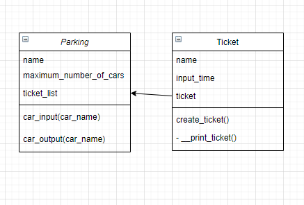

#**Homework**

I would like to automate my parking businesses adding a machine to collect the money from all cars that came into 
the parking. The machine should do:

- [x] Get pay for each car that came to the parking
- [x] Should manage a register of each car that mean
  - [x] The data/time that the car came into the parking
  - [x] The data/time that the car came out
  - [x] The amount that car must pay
- [x] The machine should print a ticket

Note:
- [x] The problem should contain at least a class diagram

### UML diagram

